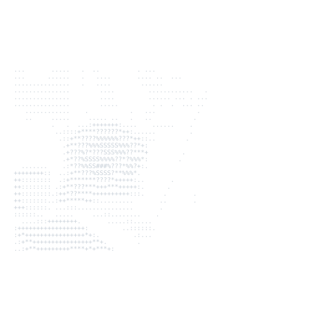
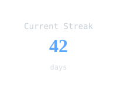

  
  
  
  [Website](https://parin-arora.vercel.app) · [GitHub](https://github.com/Parin070) · [LinkedIn](https://www.linkedin.com/in/parinarora) · [Email](mailto:parin.arora33@gmail.com)

> Third-year B.E. Computer Science student at BITS Pilani Dubai Campus, based in Dubai. 
> Interested in SOC/Blue Team work short-term, AI security (purple teaming) as long-term direction, and binary exploitation/pwn as a long game. 
> Currently building CS Head role at IEI BPDC Student Chapter Council and VP of LUG BITS Dubai.

<samp>linux &nbsp; python &nbsp; c/c++ &nbsp; bash &nbsp; wireshark &nbsp; docker &nbsp; git</samp>

**[GhostMap](https://github.com/Parin070/GhostMap)** &nbsp;·&nbsp; <samp>osint, cli</samp> 
OSINT CLI tool aiming to simplify bug bounty and pentesting recon phase.

**[Cowrie honeypot](https://github.com/Parin070/Cowrie)** &nbsp;·&nbsp; <samp>honeypot, defense</samp> 
Homelab attack-defend setup using the Cowrie SSH/Telnet honeypot.

**[VAULT](https://github.com/Parin070/VAULT)** &nbsp;·&nbsp; <samp>ctf, writeups</samp> 
CTF writeups site.

  
  
  

---

  This page is self-generated every 24 hours. No third-party servers, no iframes. SVGs are built via GitHub Actions and inline subsetted JetBrains Mono fonts.

